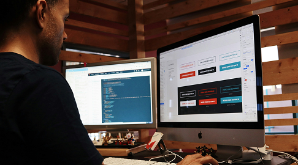

# CV Web - Jordy Miguel Torres Pila

Este repositorio contiene el código fuente de mi Currículum Vitae en formato web. El proyecto fue desarrollado utilizando tecnologías como **HTML5**, **CSS3**, **Bootstrap 5** y **Bootstrap Icons**, con un diseño adaptable y profesional, ideal para destacar mi experiencia como desarrollador full stack.

## 🛠 Tecnologías utilizadas

- HTML5
- CSS3
- Bootstrap 5
- Bootstrap Icons
- Google Fonts

---

## 📄 Características del proyecto

- Diseño tipo CV Digital
- Secciones informativas (Sobre mí, Experiencia, Educación, Proyectos)
- Formulario de contacto
- Adaptable a dispositivos móviles
- Proyectos destacados con enlaces

---

## 🔗 Enlace al prototipo en Figma

[Ver diseño en Figma](https://www.figma.com/design/QlnBitHlsDy5JTKCiPThG6/Protafolio-Lab-3---Jordy-Miguel-Torres-Pila?node-id=0-1&m=dev&t=dSlBNiLUFAw5DCmc-1)

---

## 📬 Contacto

- ✉️ Email: [miguetorres30@gmail.com](mailto:miguetorres30@gmail.com)  
- 💬 WhatsApp: [+593 98 027 1574](https://wa.me/593980271574)  
- 💻 GitHub: [@Miguetorresp](https://github.com/Miguetorresp)

---

## 🖼️ Capturas del proyecto

---

## 📢 Licencia

Este proyecto es de uso educativo y personal. Puedes modificarlo libremente con fines no comerciales.
